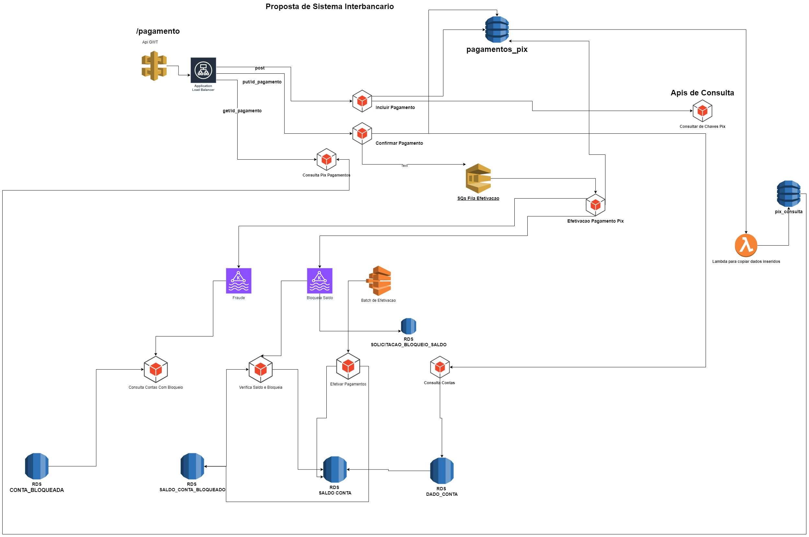

# Etapa 1

Nesta etapa, será criado o desenho do projeto, onde veremos ponto a ponto onde iremos atuar em cada etapa.

## Desenho Geral do Projeto

## Estratégia
Como o desenho do projeto é extenso, será dividido em várias etapas. Sugiro começar desenvolvendo as bordas ou fronteiras do projeto e gradualmente avançando para o centro do projeto. Abaixo listarei as responsabilidades de cada aplicação.

### Lista de Aplicações a serem criadas
   - [Consulta Conta](#)
   - [Consulta Chave Pix](#)
   - [Api de Fraudes](#)
   - [Api de Verifica Saldo e Bloqueia](#consulta-conta)
   - [Api de Inclusão Pagamento](#inclusão-de-pagamento-pix)
   - [Api de Autorização Pagamento](#autorizar-pagamento-pix)
   - [Efetivação de Pagamento](#efetivar-pagamento-pix)

### Coração da Ideia do Projeto
Desenvolver uma aplicação PIX pagamentos completa, desda inclusão autorização e efetivação do pagamento passando pelas etapas de consulta dados 
pagamento e chaves de acesso e aplicações de consumo de mensageria.
1. ### Inclusão de Pagamento Pix
    - Irá receber uma requisição do tipo POST com o JSON.
    - [Link do Contrato](contratos/inclusao_pagamento_pix/contrato.json)
    - [Link do Exemplo](contratos/inclusao_pagamento_pix/exemplo.json)
    - Tipos de chaves de pagamento possíveis:
        - email
        - chave_aleatoria
        - cpf
        - telefone
    - Validações do contrato:
        - Ao incluir o pagamento, deverá validar se todos os atributos estão preenchidos.
        - A data do pagamento deverá ser superior ou igual à data atual.
        - O valor do pagamento deverá ser superior a ZERO.
    - Procedimento:
        - Ao efetivar o pagamento, deverá receber o payload do contrato e consultar a agência e a conta origem na API [nome_api_consulta].
        - Ao enviar agência e conta para essa API, o retorno dela deverá ser [Link do Exemplo](contratos/consulta_conta_origem/exemplo.json).
        - Se houver retorno válido dessa API, enriquecer os dados do domínio da aplicação para salvar. Caso não exista, a inclusão do pagamento deverá ser negada.
        - Consultar chave pix destino.
        - Ao consultar chave pix, o retorno deve ser [Link do Contrato](contratos/consulta_chave_pix/contrato.json).
        - Se houver retorno válido dessa API, enriquecer os dados do domínio da aplicação para salvar. Caso não exista, a inclusão do pagamento deverá ser negada.
        - Depois, será gravado na tabela de pagamentos_pix [Link da Estrutura da Tabela](banco_dados/pagamentos_pix.json).
2. ### Autorizar Pagamento Pix
   - Irá receber uma requisição PUT.
   - Validações do contrato:
      - Validação do id pagamento existente
   - Procedimento:
      - Validação se a situação do pagamento é aguarando_confirmação 
      - Envia Sqs para fila de efetivação
      - Grava na tabela pagamento_pix com situação aguardando_efetivacao
3. ### Efetivar Pagamento Pix
   - Consumira Msgs Sqs [Link do Contrato](contratos/efetivacao_sqs_pix/contrato.json).
   - Validações do contrato:
      - Validação do id pagamento existente
      - Valida se data do pagamento é maior que a data atual
   - Procedimento:
     - Produtor Msg Kafka
     - Para toda msg enviada o cabecalho ou header das msgs kafka será eviado os seguintes argumentos
       - chave_pix = vem da inclusão do pagamento
       - id_pagamento_pix = uuid gerado na inclusão do pagametno
       - tipo_pagamento = "pix"
     - Envia primeiro para aplicação de fraude na fila mencionada e tendo retorno se é ou não fraude ele bloqueia saldo e com id do bloqueio ele efetiva transação na app de fetivacao
        - Envia Fraude de pix passando agencia e conta do pagador chave pix recebedor [Link do Contrato](contratos/fraude_validacao/contrato.json).
        - Envia Bloqueia Saldo [Link do Contrato](contratos/bloqueio_saldo/contrato.json).
        - Efetiva Pagamento Pix [Link do Contrato](contratos/efetivacao_sqs_pix/contrato.json).
     - Consumer Kafka
       - Filtrando msgs no header ou no cabecalho  tipo_pagamento = "pix"
         - Consome Retorno de Fraudes [Link do Contrato](contratos/fraude_validacao/retorno_contrato.json).
         - Consome Retorno de Bloqueio de Saldo [Link do Contrato](contratos/bloqueio_saldo/retorno_contrato.json).
         - Consome Retorno de da efetivação do pagaemtno [Link do Contrato](contratos/efetivacao_pagamento_conta/retorno_contrato.json).
     - Casos :
       - Em caso de fraude gravar situacao do pix como suspeita_de_fraude 
       - Em caso de bloqueio de saldo por falta de saldo ele gravará cliente_sem_saldo
       - Em caso de erro na efetivação por falta gravará erro_na_efetivacao

4. ### Consulta Conta
    - Essa api recebe via get agencia e conta e devolve esse contrato [Link do Contrato](contratos/consulta_conta_origem/contrato.json). 
    - Faça um tabela chamada dados_conta [Link da extrutura do banco de dados](banco_dados/dados_conta.json). 
    - E pode fazer uma pequena massa de registros como preferir 
    - Essa api deverá consultar por agencia e conta nessa tabela 
    - e deverá retornar os dados informados no contrato

5. ### Consulta Chave Pix
    - Essa api recebe via get chave e tipo de chave e devolve esse contrato [Link do Contrato](contratos/consulta_chave_pix/contrato.json).
    - Faça um tabela chamada chave_pix [Link da extrutura do banco de dados](banco_dados/dados_chave_pix.json).
    - E pode fazer uma pequena massa de registros como preferir
    - Essa api deverá consultar por chave e tipo de chave nessa tabela
    - e deverá retornar os dados informados no contrato
   
6. ### Aplicação de leitura topico kafka fraude
    - Essa Api é simples ela faz leitura do topico fraude-pix recebendo esses dados [Link do Contrato](contratos/fraude_validacao/contrato.json).
    - Faça um tabela chamada fraude [Link da extrutura do banco de dados](banco_dados/dados_chave_pix.json).
    - E pode fazer uma pequena massa de registros como preferir
    - Essa api deverá consultar por chave e tipo de chave nessa tabela
    - e deverá retornar os dados informados no contrato